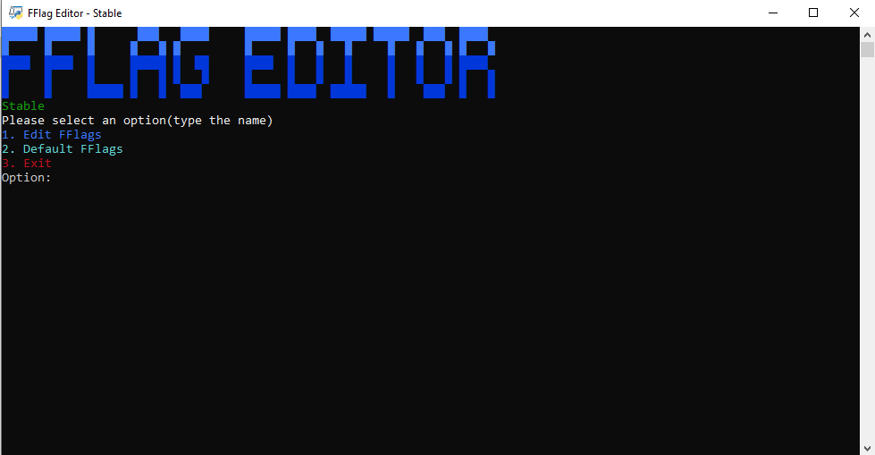

<br/>
<p align="center">
  <h3 align="center">Roblox FFlag Editor</h3>

  <p align="center">
    Code dogshit but I made it only for me
    <br/>
    <br/>
    <a href="https://github.com/Bossxer/Roblox-FFlags-Editor/issues">Report Bug</a>
    .
    <a href="https://github.com/Bossxer/Roblox-FFlags-Editor/issues">Request Feature</a>
  </p>
</p>

   

## Table Of Contents

* [About the Project](#about-the-project)
* [Getting Started](#getting-started)
  * [Prerequisites](#prerequisites)
  * [Installation](#installation)
* [Usage](#usage)
* [Contributing](#contributing)
* [Author](#author)

## About The Project



The reason I made this was cause I saw a other FFlag editor and you needed [bloxstrap](https://github.com/pizzaboxer/bloxstrap) install to actually use it, so I decided to try and make on where you didn't need bloxstrap installed. NOTE: the one where you need bloxstrap might and is probably better than mine.

## Getting Started

To get it and running follow these simple example steps.

### Prerequisites

to use FFlag editor you need.

* python 3.12


### Installation

1. Download python at [https://www.python.org/](https://www.python.org/)

2. Download the repo

3. Install the requirements

```sh
pip install -r requirements.txt
```

4. run main.py

## Usage

Just go on there and use the numbers that are displayed near the option you want.

## Author

* **Bossxer** - *Main coder* - [Bossxer]() - **

### [Go back to the start](#roblox-fflag-editor)
